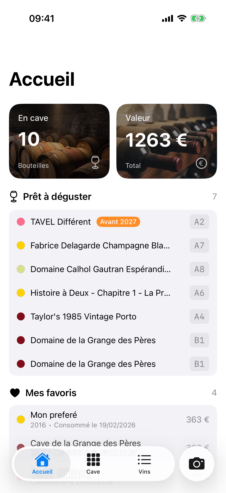
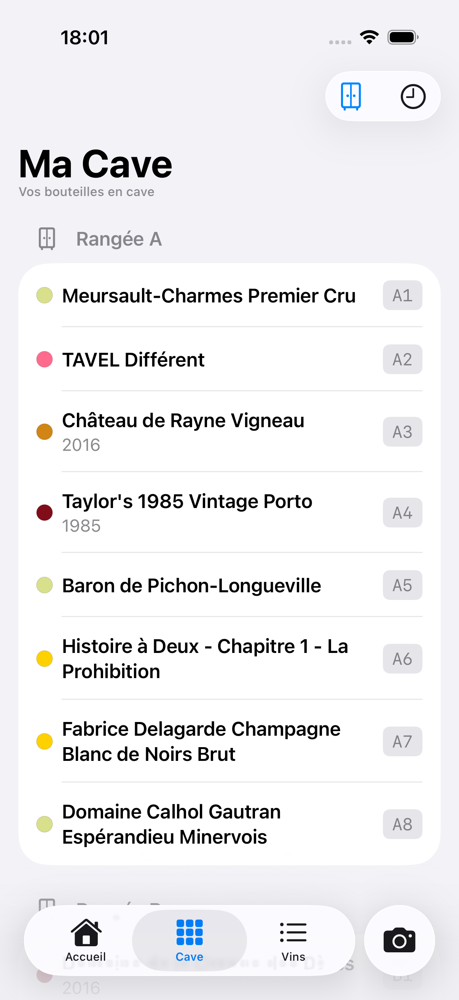
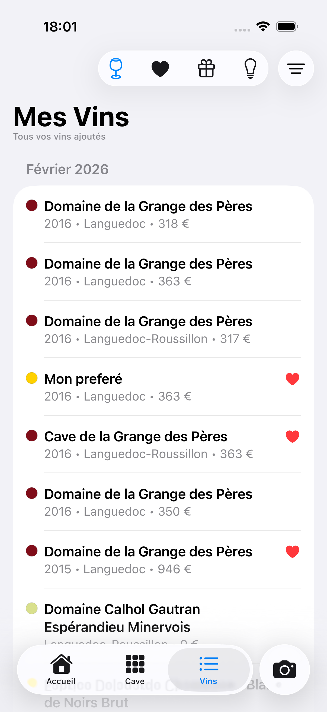
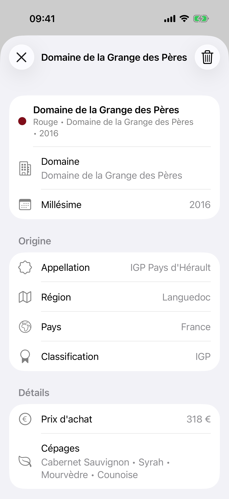
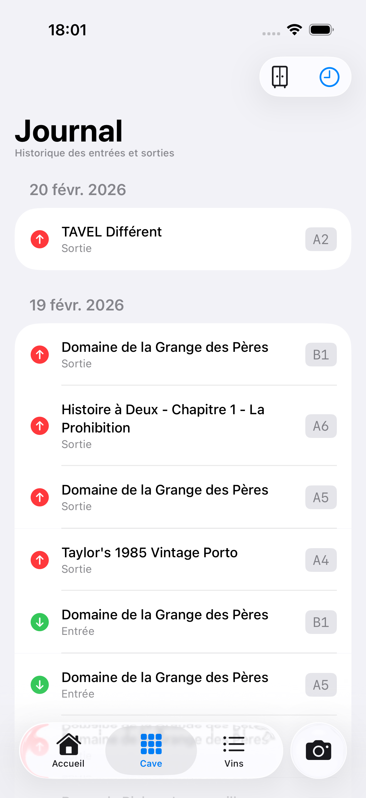
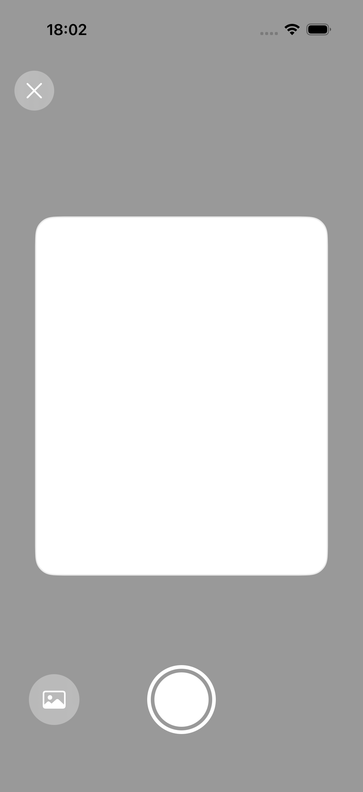
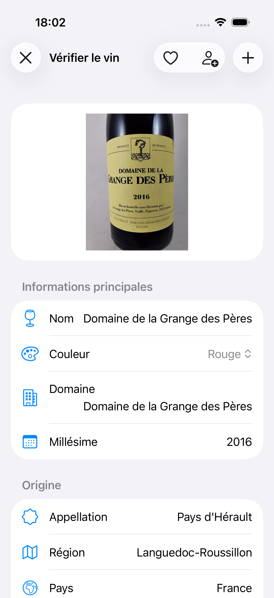

# Cave-a-Vin

A purely functional approach to wine cellar management.

<p align="center">
  
  
  
</p>

## Features

- **AI scan** — photograph a label, get structured wine data + price estimate (Claude Sonnet 4.6 vision + Gemini 2.0 Flash web search)
- **Cellar grid** — physical position tracking by row and column
- **Journal** — entry/exit history with tasting notes and ratings
- **Dashboard** — cellar stats, total value, ready-to-drink alerts, recent activity
- **Wine catalog** — full metadata, grape varieties, appellations, drink windows

<p align="center">
  
  
</p>

<p align="center">
  
  
</p>

## Tech Stack

| Layer    | Stack                                                                     |
| -------- | ------------------------------------------------------------------------- |
| iOS      | SwiftUI, Swift 6, iOS 26, Apollo iOS, Firebase Auth (Sign in with Apple) |
| Backend  | Nitro on Firebase Cloud Functions Gen 2, Apollo Server 5, Pothos          |
| Storage  | Firestore (multi-user, isolated by `userId`)                              |
| AI       | Claude Sonnet 4.6 (vision), Gemini 2.0 Flash (web search)                 |
| Infra    | Terraform (google + google-beta) — provisions everything from scratch    |

## One-shot bootstrap

The entire stack — GCP project, Firebase, Firestore (rules + indexes),
Identity Platform with Apple Sign-In, Cloud Function Gen 2, secrets,
iOS app registration with `GoogleService-Info.plist` generated locally —
is provisioned by `make bootstrap`.

### Prerequisites

- `gcloud` CLI authenticated with Application Default Credentials :
  `gcloud auth application-default login`
- `terraform >= 1.6`
- `bun`
- `jq`
- An Apple Developer account with a Service ID + Sign in with Apple enabled
  + a `.p8` private key (see [`ios/FIREBASE_SETUP.md`](ios/FIREBASE_SETUP.md))
- A GCP billing account id and either an `org_id` or `folder_id`

### Run

```bash
cp infra/terraform.tfvars.example infra/terraform.tfvars
# Edit infra/terraform.tfvars: project_id, billing, Apple, secrets
cp ~/Downloads/AuthKey_KEY1234567.p8 infra/

make bootstrap
```

That single command :

1. validates prerequisites,
2. builds the Nitro firebase-preset bundle (`.output/server/`),
3. `terraform init && terraform apply` — creates the GCP project, enables
   ~15 APIs, provisions Firebase + Firestore (Native, eur3), configures
   Identity Platform + Apple OAuth, registers the iOS app and writes the
   `GoogleService-Info.plist`, stores secrets in Secret Manager, deploys
   the Cloud Function (Gen 2, nodejs22, europe-west3),
4. migrates Terraform state to a versioned GCS bucket,
5. POSTs `/admin/migrate` to apply Firestore migrations,
6. prints the function URL, the iOS plist path, and the GitHub
   secrets/vars to set for subsequent CI deploys.

After `make bootstrap` finishes, commit `infra/backend.tf` (generated by
the script) so the GitHub Actions deploy workflow can read the same state.

### Subsequent deploys

Push to `main`. The [`deploy.yml`](.github/workflows/deploy.yml) workflow
authenticates via Workload Identity Federation, builds the Nitro bundle,
runs `terraform apply` (which only diffs the Cloud Function source
archive), then triggers the migration endpoint.

### Teardown

```bash
make destroy   # removes the GCP project and all Firebase resources
```

## Local development (without Firebase)

```bash
cp .env.example .env  # fill in API keys
bun install
bunx nitro prepare
bun run dev           # http://localhost:3000

# Or with the Firebase emulator suite:
firebase emulators:start --only auth,firestore,functions
```

Required environment variables (`.env`) :

```
NITRO_ANTHROPIC_API_KEY=sk-ant-...
NITRO_GOOGLE_API_KEY=...
NITRO_ADMIN_TOKEN=...
NITRO_SENTRY_DSN=...    # optional
```

## iOS App

1. Open `ios/CaveAVin.xcodeproj` in Xcode.
2. After `make bootstrap`, `GoogleService-Info.plist` is already at
   `ios/CaveAVin/`. Drag it into the `CaveAVin` target in Xcode.
3. Add the SPM packages and the Sign in with Apple capability — see
   [`ios/FIREBASE_SETUP.md`](ios/FIREBASE_SETUP.md).
4. Run `apollo-ios-cli generate` (from `ios/`) to regenerate typed
   GraphQL operations from `shared/schema.graphql`.
5. Build and run on the iPhone 17 simulator (iOS 26.2).
