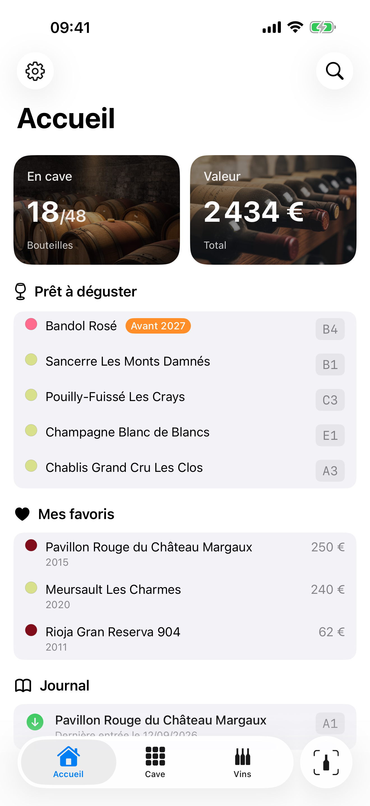
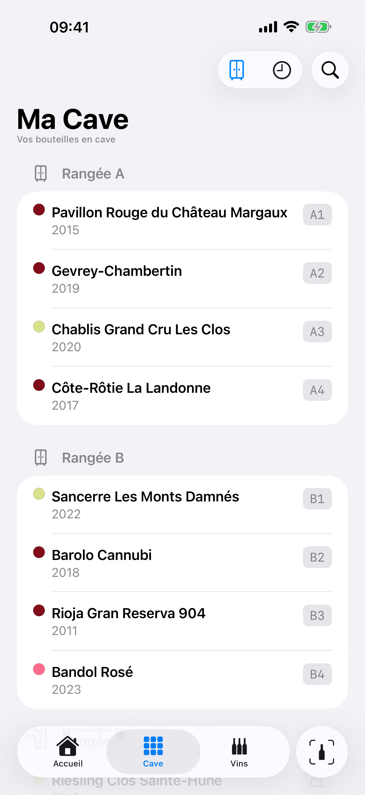
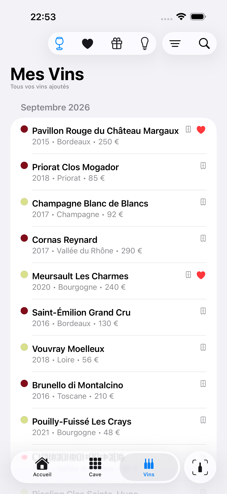
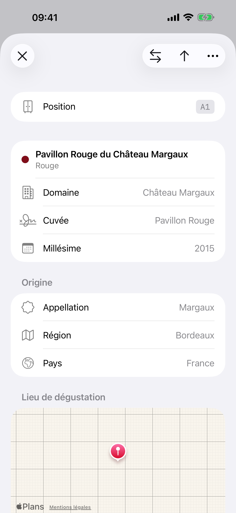
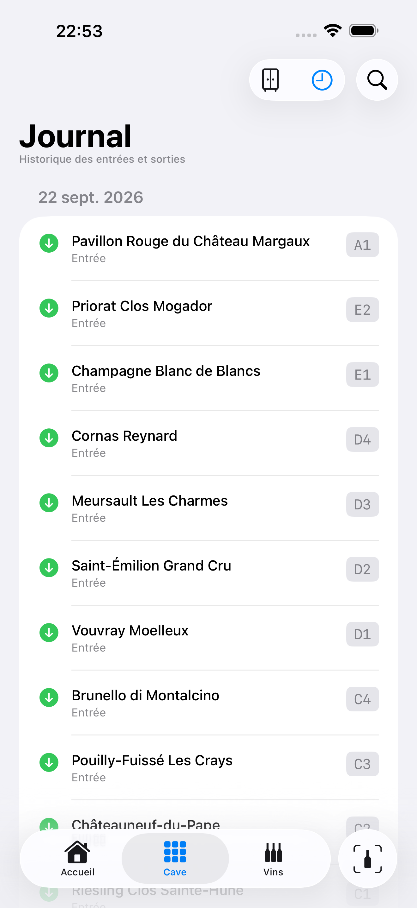
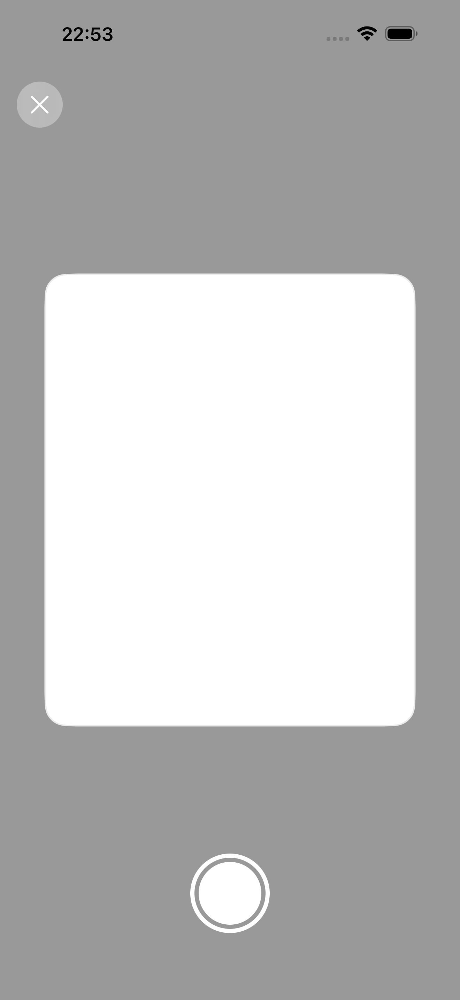
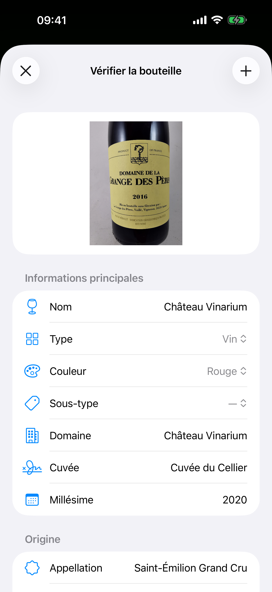

# Vinarium

A purely functional approach to wine cellar management.

<p align="center">
  
  
  
</p>

## Features

- **AI scan** — photograph a label, get structured wine data + price estimate (Gemini 2.5 Flash vision + Google Search grounding). The reading tells the three names a label crowds together apart: the estate, the cuvée it bottled and the wine's own name, so "Domaine Leflaive, Puligny-Montrachet 1er Cru Les Pucelles" lands in three fields instead of one. The scan button opens a sheet with the camera and the last photos of the library, and a text field: typed on its own it names the wine without a photo ("Grange des Pères 2016 rouge"), typed before a photo it settles what the label leaves out
- **Cellar grid** — physical position tracking by row and column
- **Journal** — entry/exit history with tasting notes and ratings
- **Dashboard** — cellar stats, total value, ready-to-drink alerts, recent activity
- **Wine catalog** — full metadata, grape varieties, appellations, cuvées, drink windows, structured subtypes for every beverage (porto, rum, blonde ale, sparkling sake…)
- **Attachments** — up to five files on any bottle, wine or whisky alike: a photo taken on the spot, one picked from the library, or a PDF pulled from Files (the purchase invoice, a producer's data sheet). The bytes go straight to a private Cloud Storage bucket over a URL the server signs for that one object, never through the API, and nothing in the bucket is reachable any other way. A household member reading a bottle standing in the shared cellar sees its files; only the owner adds or deletes one. Files leave with the bottle, with the account, and with a restore
- **Global search** — full-screen search across names, producers, cuvées, subtypes, regions, vintages and people (gifts, recommendations), ranked by relevance and grouped by match (in cellar, consumed, gifts…), with combinable facet chips. Words are matched independently and in any order, so "bordeaux margaux" and "margaux 2015" both land; every wine carries its searchable terms in a Firestore array, so a query reads the wines it returns rather than the whole cellar. A typed category reaches the bottles that carry it in any of the seven served languages: "champagne", "pétillant" and "Sekt" all find a sparkling wine whose label spells none of them, and "vendanges tardives" is read as one term rather than two words. A bottle from the Champagne region still outranks a crémant that merely shares the kind
- **Household sharing** — share one cellar with the people you live with via an invite code: a common grid where any member can place, move, drink or gift any bottle. Sharing the cellar shares what it holds — its bottles, their total value, the ready-to-drink alerts and every movement in the journal, each one badged with the member behind it. Shared-cellar bottles also surface in every member's wine list and search, badged with their owner's name, while each person's out-of-cellar catalog and tasting notes stay private
- **Onboarding** — a first-launch wizard that collects the user's first name and sizes the cellar (rows A→Z × slots per row), with a searchable catalog of real consumer wine coolers (grouped by brand) for automatic dimensioning and the temperature-zone count; the grid dimensions are configurable per scope rather than fixed
- **Premium** — the app is free and the cellar, journal, sharing and manual entry stay unlimited; only the AI scan is metered (5 a month, plus 20 granted once at the end of onboarding so a new cellar can be stocked before the meter is ever felt). Vinarium Premium lifts the meter, sold as an auto-renewable subscription (monthly, or yearly with a 7-day free trial and a discount badge computed from the store's own prices), purchased through StoreKit 2 and verified server-side against Apple's signed transactions
- **Localization** — the app ships in 7 languages (French, English, German, Spanish, Italian, Portuguese, Japanese) through a String Catalog. The AI scan writes its free-text values in the caller's language (driven by `Accept-Language`, with the scan cache partitioned per language), and prices show in the user's currency (stored canonically in euros, converted at display and input)
- **Feedback** — a "Write to us" row in the settings opens a sheet where the user picks a subject (a problem or a suggestion) and writes a message. It reaches the Sentry feedback inbox, beside the errors the app already reports, tagged with its subject. Only the message travels: no name and no email
- **Admin metrics** — an admin-only banner and screen showing the month's economics: measured AI cost from real Gemini tokens, the measured GCP bill (BigQuery billing export), App Store revenue (App Store Connect Sales Reports), user and subscriber counts. AI usage is metered live at each scan; the rest is a projection a daily scheduler refreshes. Gated by a flag on the user profile
- **Account control** — full data portability (export the whole account to a JSON envelope, restore it under any account) plus account deletion: one confirmed action erases every trace of the account (cellar, journal, tastings, gifts, recommendations, quotas, entitlement, profile), leaves any shared household first so ownership passes on, and removes the Firebase identity last

<p align="center">
  
  
</p>

<p align="center">
  
  
</p>

## Tech Stack

| Layer    | Stack                                                                     |
| -------- | ------------------------------------------------------------------------- |
| iOS      | SwiftUI, Swift 6, iOS 26, Apollo iOS, StoreKit 2, Firebase Auth (Sign in with Apple), Firebase Analytics |
| Backend  | Nitro on Firebase Cloud Functions Gen 2, Apollo Server 5, Pothos          |
| Storage  | Firestore (multi-user, isolated by `userId`, shared cellars via households), Cloud Storage for attachments (private bucket, V4 signed URLs) |
| AI       | Gemini 2.5 Flash (vision + Google Search grounding)                       |
| Metrics  | App Store Connect Sales Reports API + BigQuery billing export (admin economics) |
| Infra    | Terraform (google + google-beta) — provisions everything from scratch    |
| Observability | Sentry (one trace from the tap to the resolver, symbolicated iOS crashes, per-release source maps), GA4 for the activation funnel (muted in Debug and under UI tests) |
| Testing  | `bun:test` for the backend, XCUITest against the Firebase emulators for the app ([docs/e2e.md](docs/e2e.md)) |

## One-shot bootstrap

The entire stack — GCP project, Firebase, Firestore (rules + indexes),
Identity Platform with Apple Sign-In, Cloud Function Gen 2, secrets,
iOS app registration with `GoogleService-Info.plist` generated locally —
is provisioned by `bun run bootstrap`.

### Prerequisites

- `gcloud` CLI authenticated with Application Default Credentials :
  `gcloud auth application-default login`
- `bun`
- An Apple Developer account with a Service ID + Sign in with Apple enabled
  + a `.p8` private key (see [`ios/FIREBASE_SETUP.md`](ios/FIREBASE_SETUP.md))
- A GCP billing account id and either an `org_id` or `folder_id`

> `terraform` is auto-downloaded (pinned version, checksum-verified) into
> `infra/.bin/` on first `bun run bootstrap` / `bun run infra:plan|infra:apply|destroy`.
> `jq` is replaced by `bunx node-jq` (pulled in by `bun install`).

### Run

```bash
cp infra/terraform.tfvars.example infra/terraform.tfvars
# Edit infra/terraform.tfvars: project_id, billing, Apple, secrets
cp ~/Downloads/AuthKey_KEY1234567.p8 infra/

bun run bootstrap
```

That single command :

1. validates prerequisites,
2. builds the Nitro firebase-preset bundle (`.output/server/`),
3. `terraform init && terraform apply` — creates the GCP project, enables
   ~15 APIs, provisions Firebase + Firestore (Native, eur3), configures
   Identity Platform + Apple OAuth, registers the iOS app and writes the
   `GoogleService-Info.plist`, stores secrets in Secret Manager, deploys
   the Cloud Function (Gen 2, nodejs22, europe-west3),
4. migrates Terraform state to a versioned GCS bucket,
5. POSTs `/admin/migrate` to apply Firestore migrations,
6. prints the function URL, the iOS plist path, and the GitHub
   secrets/vars to set for subsequent CI deploys.

After `bun run bootstrap` finishes, commit `infra/backend.tf` (generated by
the script) so the GitHub Actions deploy workflow can read the same state.

### Subsequent deploys

Push to `main`. The [`deploy.yml`](.github/workflows/deploy.yml) workflow
authenticates via Workload Identity Federation, builds the Nitro bundle,
runs `terraform apply` (which only diffs the Cloud Function source
archive), then triggers the migration endpoint.

### Teardown

```bash
bun run destroy   # removes the GCP project and all Firebase resources
```

## Local development (without Firebase)

```bash
cp .env.example .env  # fill in API keys
bun install
bunx nitro prepare
bun run dev           # http://localhost:3000

# Or with the Firebase emulator suite:
firebase emulators:start --only auth,firestore,functions
```

Required environment variables (`.env`) :

```
NITRO_GOOGLE_API_KEY=...
NITRO_ADMIN_TOKEN=...
NITRO_SENTRY_DSN=...    # optional, and ignored in dev: Sentry only runs in a built bundle
```

## iOS App

1. Open `ios/Vinarium.xcodeproj` in Xcode.
2. After `bun run bootstrap`, `GoogleService-Info.plist` is already at
   `ios/Vinarium/`. Drag it into the `Vinarium` target in Xcode.
3. Add the SPM packages and the Sign in with Apple capability — see
   [`ios/FIREBASE_SETUP.md`](ios/FIREBASE_SETUP.md).
4. Run `apollo-ios-cli generate` (from `ios/`) to regenerate typed
   GraphQL operations from `shared/schema.graphql`.
5. Build and run on the iPhone 17 simulator (iOS 26.2).
